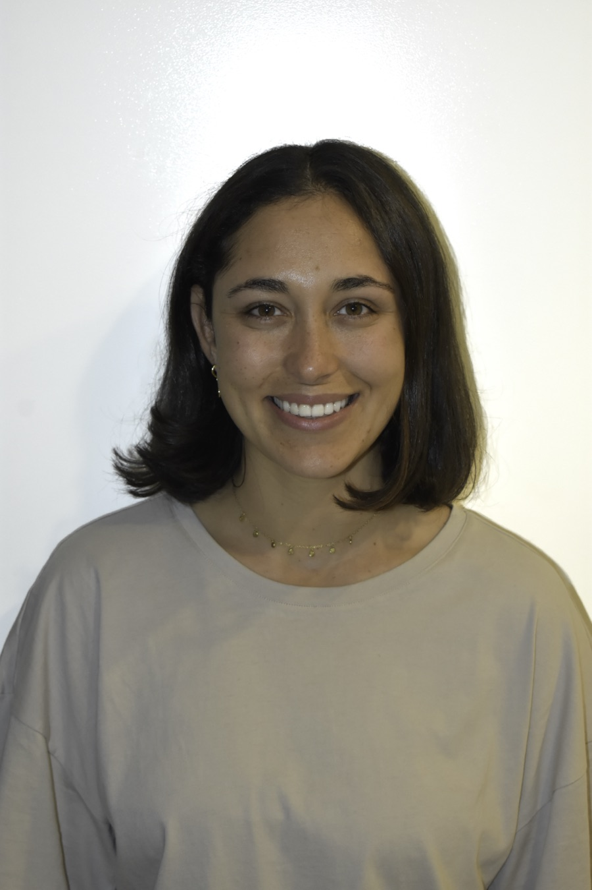
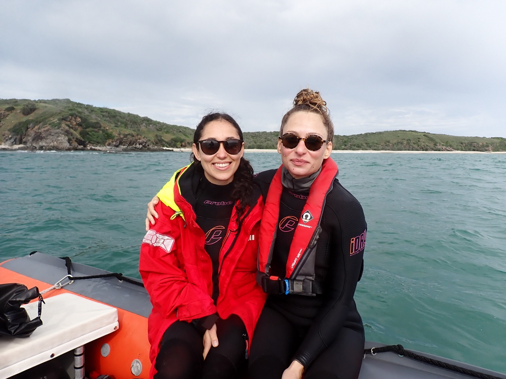
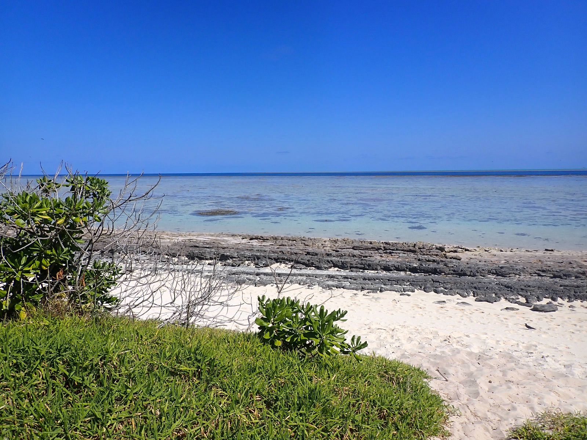

{.portrait fig-alt="Portrait of Ilha Byrne"}

I am a marine biologist and PhD candidate in ecology and evolutionary biology at the **University of Queensland** in Brisbane, Australia. My research asks how genetic diversity and adaptation are shaped in marine invertebrates — particularly reef-building corals — and what that means for their conservation in a changing ocean.

My path into science began underwater. Before university I trained and worked as a **PADI Divemaster**, which turned a love of the ocean into a determination to understand and protect it. I went on to study marine science at UQ, completing First-Class Honours on using **DNA metabarcoding** to characterise the distribution of planktonic echinoderm larvae, and graduating with the **University Medal** as Faculty Graduate of the Year.

Since then I have worked across molecular labs, reef fieldwork and coastal communities — with the **Riginos Research Group**, the **Marine Spatial Ecology Lab** and the **Tibbetts Lab**, and on programs including the **Reef Restoration and Adaptation Program** and **Sustainable Urban Seascapes Moreton Bay**. My work combines **population genomics**, **environmental DNA** and **community ecology** to connect patterns of genetic variation to the reef environments that produce them.

I am supported by an **ELEVATE Boosting Women in STEM Scholarship** and was a **Global Change Scholar** with UQ and CSIRO. Beyond the lab and the reef, I am an active science communicator and a long-standing volunteer with **Reef Check Australia**, working to bring marine science to schools, community groups and the public.

::: {.figure-grid}
{fig-alt="Ilha Byrne and a colleague in dive gear on a research vessel"}

{fig-alt="Coral reef flat and white sand beach under blue sky"}
:::

::: {.callout-note appearance="simple"}
Looking for a quick overview? [Download my CV](files/CV.pdf) or [get in touch](cv.html).
:::
