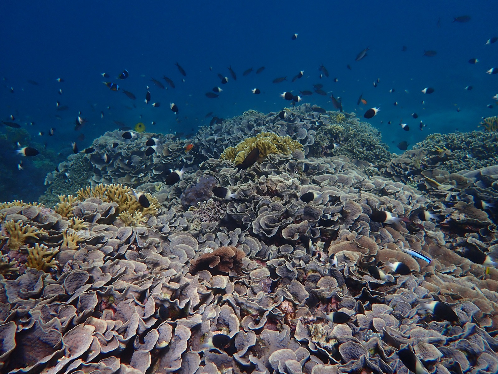
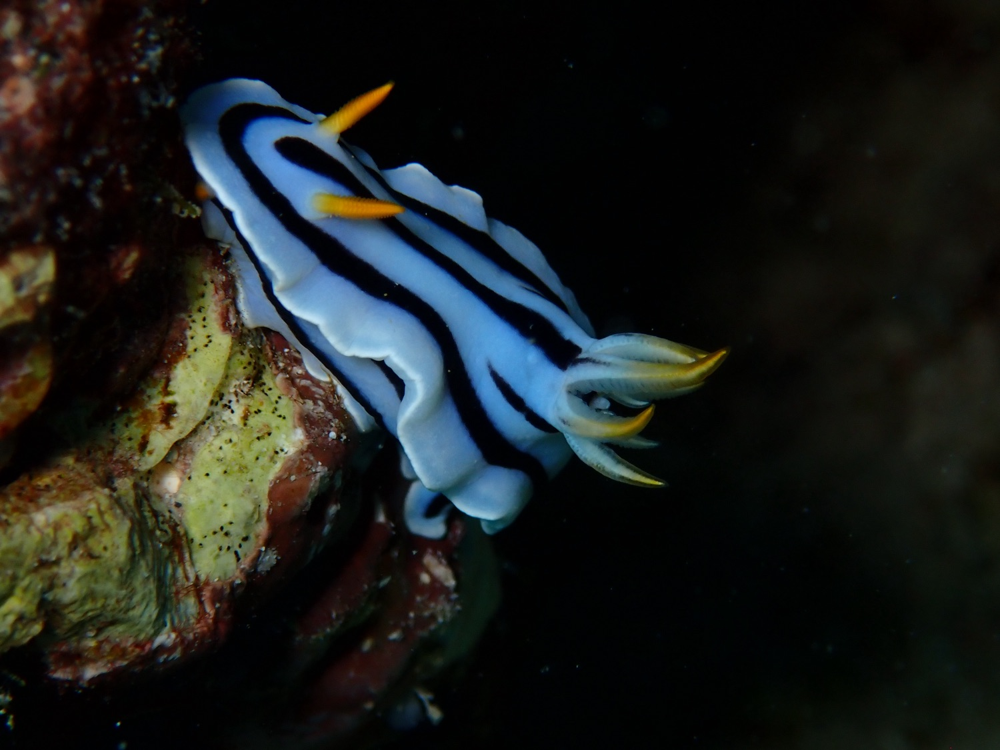
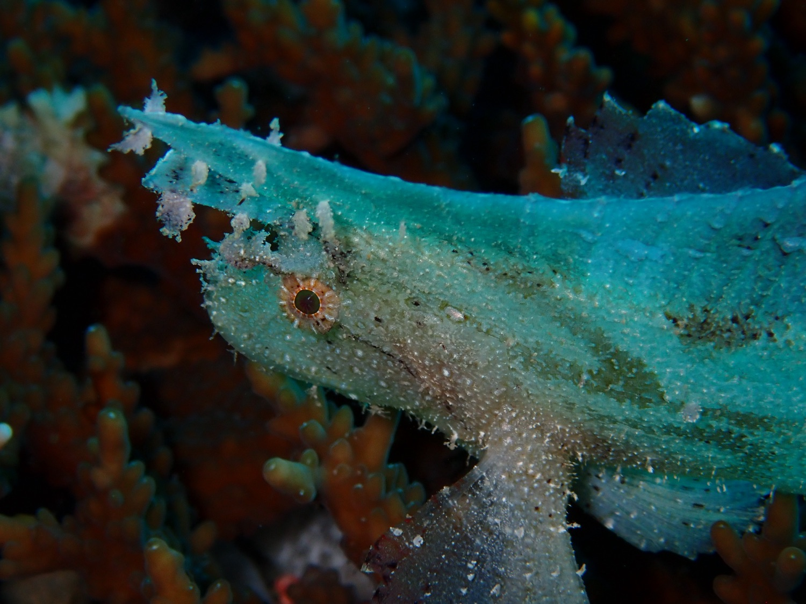
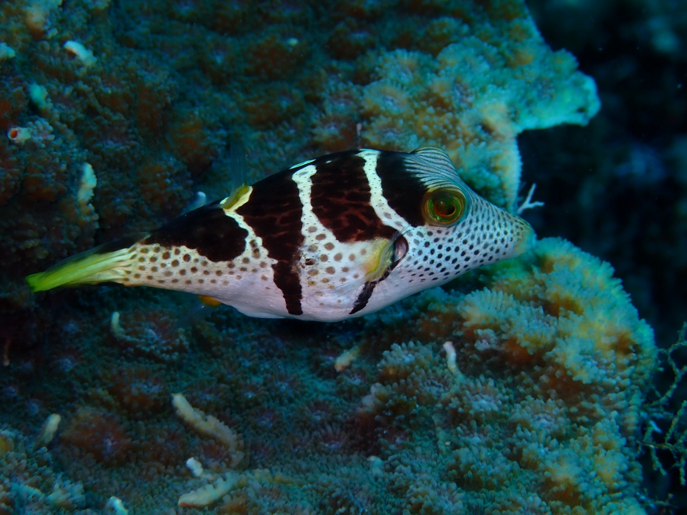
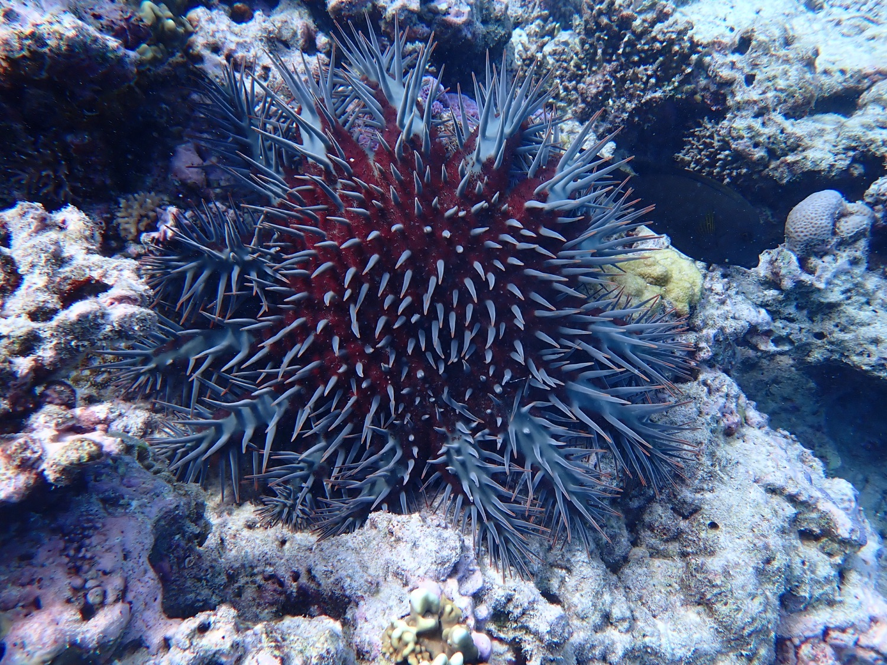
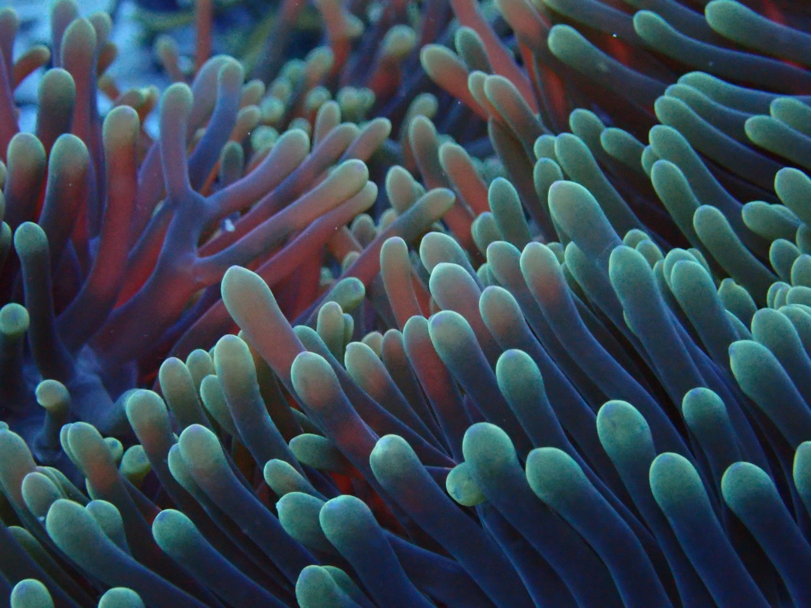
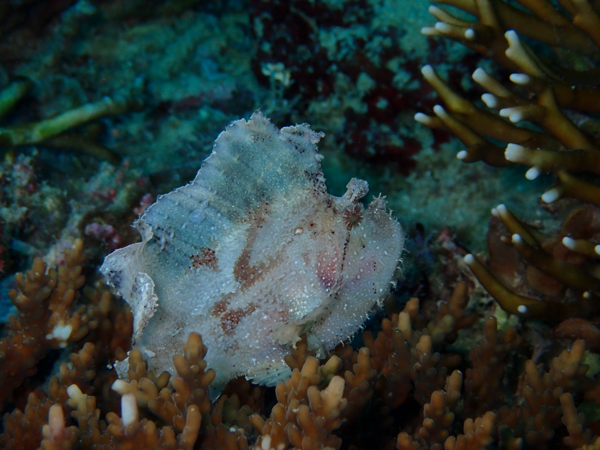
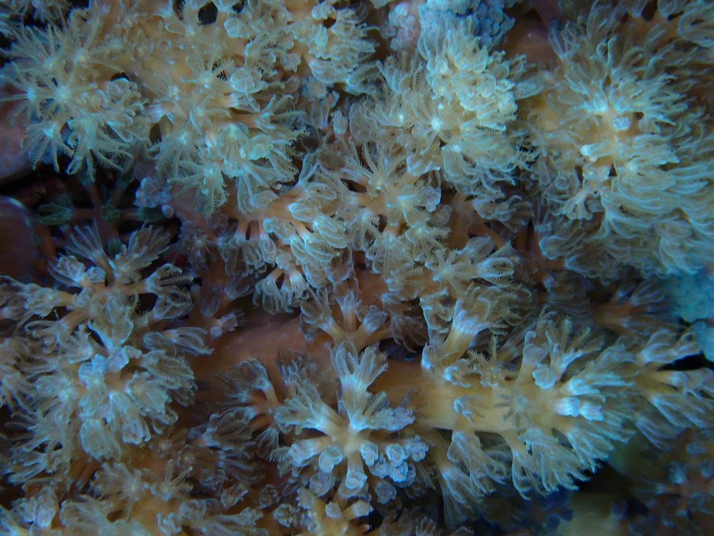
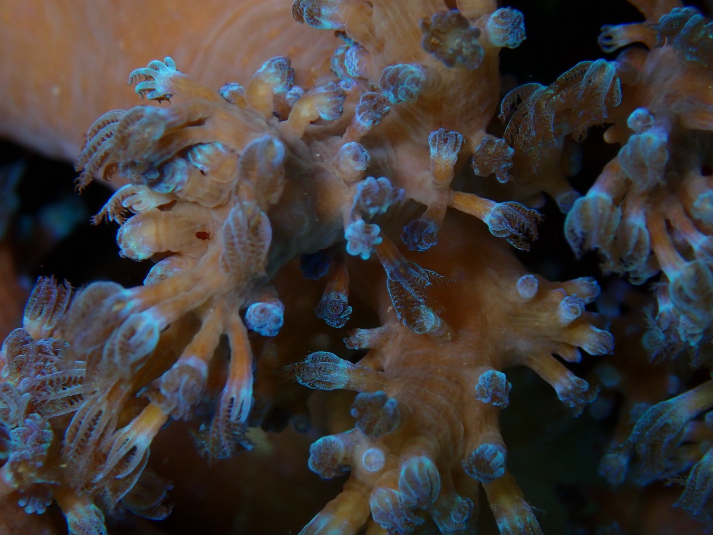
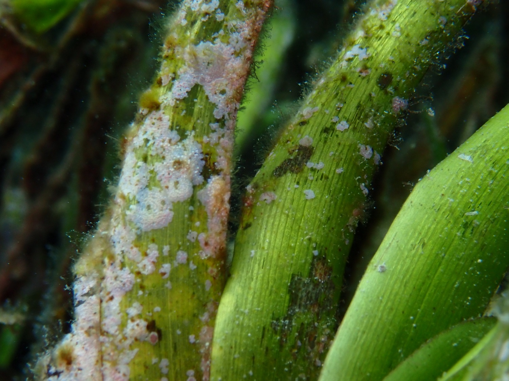

*Click any photo to view it full size.*

::: {.gallery}
<figure><a href="images/gallery/reefscape.jpg" target="_blank"><figcaption>Reef-scape with schooling damselfish</figcaption></a></figure>

<figure><a href="images/gallery/nudibranch.jpg" target="_blank"><figcaption>Chromodoris nudibranch</figcaption></a></figure>

<figure><a href="images/gallery/leaf-scorpionfish.jpg" target="_blank"><figcaption>Leaf scorpionfish</figcaption></a></figure>

<figure><a href="images/gallery/toby.jpg" target="_blank"><figcaption>Black-saddled toby</figcaption></a></figure>

<figure><a href="images/gallery/crown-of-thorns.jpg" target="_blank"><figcaption>Crown-of-thorns seastar</figcaption></a></figure>

<figure><a href="images/gallery/anemone.jpg" target="_blank"><figcaption>Sea anemone</figcaption></a></figure>

<figure><a href="images/gallery/leaf-scorpionfish-white.jpg" target="_blank"><figcaption>Leaf scorpionfish, pale morph</figcaption></a></figure>

<figure><a href="images/gallery/soft-coral-1.jpg" target="_blank"><figcaption>Soft coral polyps</figcaption></a></figure>

<figure><a href="images/gallery/soft-coral-2.jpg" target="_blank"><figcaption>Soft coral polyps</figcaption></a></figure>

<figure><a href="images/gallery/seagrass.jpg" target="_blank"><figcaption>Seagrass</figcaption></a></figure>
:::

::: {.callout-note appearance="simple"}
All images © Ilha Byrne. Please get in touch before reusing them.
:::
