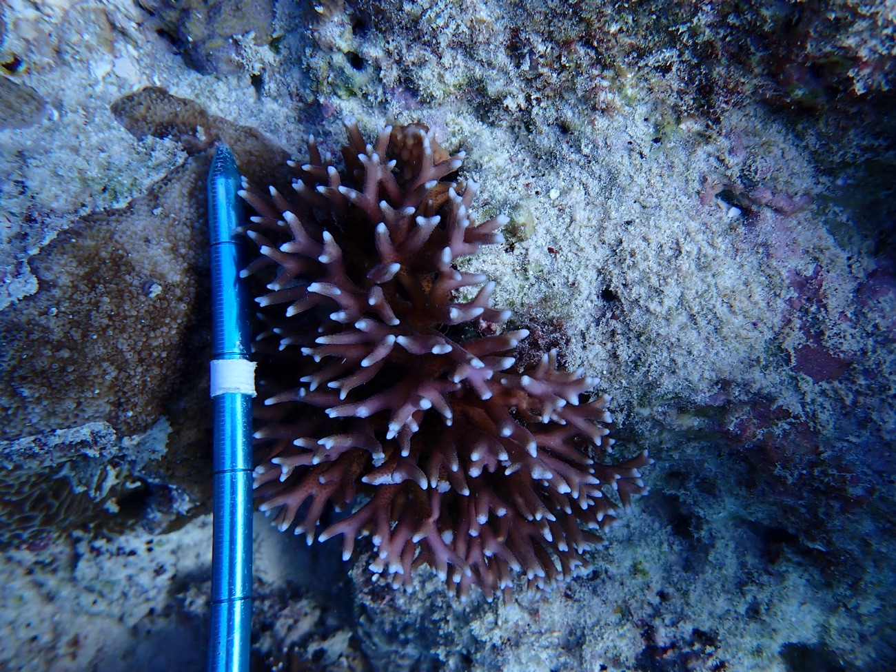
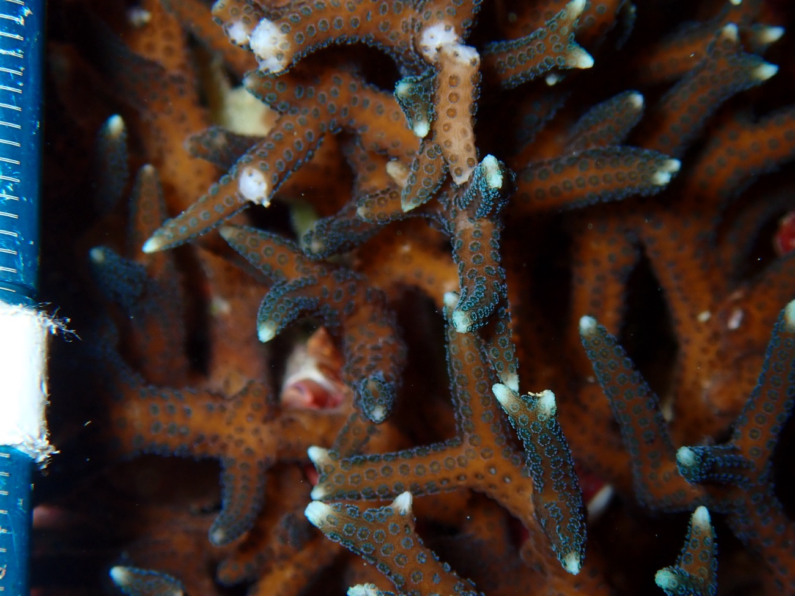
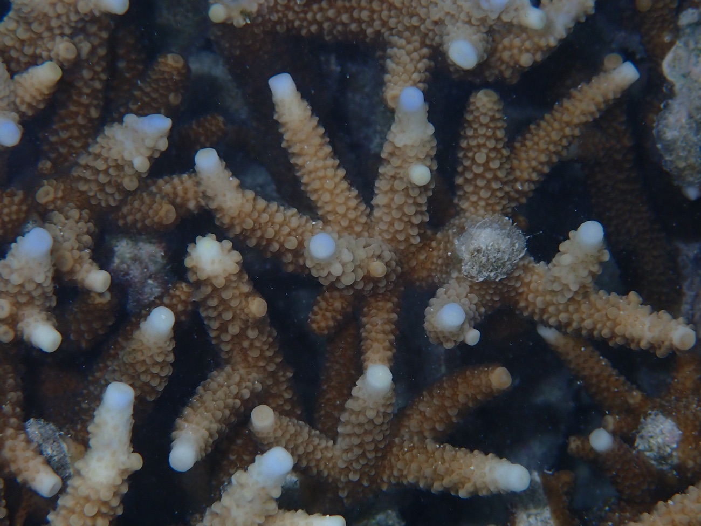

My research connects **genetic variation** to the **ecological and environmental context** that produces it. I work across scales — from the DNA within a single coral colony to the composition of whole reef communities — using genomics, molecular tools and field ecology to inform marine conservation.

## Coral population &amp; conservation genomics

Reef-building corals hold enormous genetic diversity, yet we still understand little about how it is partitioned across species, habitats and reefs. I use **population genomics** to resolve cryptic diversity and to ask how the reef environment shapes patterns of genetic variation and differentiation.

Recent projects include genomic evidence for **cryptic species and habitat specialisation in the brooding coral *Seriatopora hystrix*** along the Great Barrier Reef; estimates of genetic diversity and differentiation in the Caribbean coral ***Agaricia tenuifolia***; and **causal modelling** showing that corals in more environmentally heterogeneous reefs can carry lower genetic diversity. This work supports efforts such as the **Reef Restoration and Adaptation Program** to conserve and restore corals in a warming ocean.

::: {.figure-grid}
{fig-alt="Branching Seriatopora hystrix coral colony with a measuring scale"}

{fig-alt="Macro photograph of Seriatopora hystrix coral polyps"}

{fig-alt="Macro photograph of branching Acropora coral tips"}
:::

## Environmental DNA &amp; biodiversity monitoring

Traces of DNA shed into seawater can reveal the species present on a reef without ever seeing them. I use **environmental DNA (eDNA) and DNA metabarcoding** to detect and monitor marine biodiversity — approaches that can make surveys faster, less invasive and more sensitive to hard-to-observe life stages.

My Honours research developed metabarcoding to characterise the **spatio-temporal distribution of planktonic echinoderm larvae**, and I have applied eDNA to monitor **benthic marine communities in Quandamooka (Moreton Bay)**, linking molecular detection to community-scale change.

## Reef community ecology &amp; monitoring

Genetic and molecular data are most powerful when grounded in ecology. Through projects including **Sustainable Urban Seascapes Moreton Bay**, the **Mooloolaba Ecological Assessment and Mapping** project, and long-term **Reef Check Australia** surveys, I study how benthic reef communities are structured and how they respond to environmental pressures — connecting fieldwork, citizen science and molecular monitoring.

::: {.callout-tip appearance="simple"}
For a full list of talks and posters, see [Publications &amp; Talks](publications.html). Published work is listed on my research profiles below.
:::
